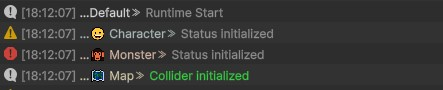

# Unity Debug Logger

한국어 / English



---

## 🌐 한국어

### 📢 소개
Unity 콘솔 로그를 채널 단위로 **더 보기 쉽게** 관리하기 위해 만든 경량 디버그 로거입니다.  
채널별 이름, 색상, 이모지를 설정할 수 있고 prefix/suffix를 적용해 콘솔 가독성을 높일 수 있습니다.

### 🚧 설치
1. 이 레포지토리를 클론합니다.
2. Unity 프로젝트의 Assets 아래에 Script 폴더를 복사합니다.
3. Unity로 돌아오면 LogChannelAsset이 자동 생성됩니다.
4. LogChannelAsset에서 채널을 수정하고 저장하면 Channel enum이 자동 갱신됩니다.

### 📜 포함된 스크립트
- Console.cs : 채널 기반 로그 출력 API
- LogFormatter.cs : prefix/suffix, 색상, 이모지 포맷팅
- LogEntry.cs : 로그 데이터 구조체
- LogChannelAsset.cs : 채널 설정 ScriptableObject
- LogChannelConfig.cs : 채널별 설정 데이터
- Channel.cs : 자동 생성 채널 enum

### 🛠️ Editor 스크립트
- LogChannelAssetAutoCreator.cs : LogChannelAsset 자동 생성
- LogChannelGenerator.cs : Channel enum 자동 생성
- LogChannelConfigDrawer.cs : 채널 설정 커스텀 드로어
- LogEmojiPickerPopup.cs / EmojiDatabaseBuilder.cs : 이모지 선택 UI
- LoggerSymbolSetup.cs : ENABLE_GAME_LOG 심볼 자동 설정

### 🚀 간단 사용법

#### 1) 기본 로그
```csharp
using UnityEngine;

Console.Log("Runtime Start");
Console.LogWarning("Status Warning");
Console.LogError("Status Error");
```

#### 2) 채널 로그
```csharp
using UnityEngine;

Console.Log(Channel.Character, "Status Initialized");
Console.Log(Channel.Monster, "Status Initialized");
Console.Log(Channel.Map, "Collider Initialized", "#64D46A");
```

#### 3) 예외 로그
```csharp
try
{
    // ...
}
catch (System.Exception e)
{
    Console.LogException(e);
}
```

### 🖼️ 출력 예시
아래 이미지는 실제 콘솔 출력 예시입니다.


### ⚙️ 참고사항
- 대부분의 로그 메서드는 ENABLE_GAME_LOG 심볼이 있을 때만 출력됩니다.
- 일반 빌드에서는 심볼이 제거되어 로그 호출이 제외될 수 있습니다.
- 채널 이름은 enum 생성을 위해 영문/숫자/언더스코어 사용을 권장합니다.
- Channel.cs는 자동 생성 파일이므로 수동 수정하지 않는 것을 권장합니다.

---

## 🌐 English

### 📢 Overview
This is a lightweight debug logger for Unity to make channel-based console logs **easier to read**.  
You can configure channel names, colors, and emojis, then apply prefix/suffix formatting for better readability.

### 🚧 Installation
1. Clone this repository.
2. Copy the Script folder under your Unity project's Assets.
3. Return to Unity and LogChannelAsset will be auto-created.
4. Edit channels in LogChannelAsset and save to regenerate Channel enum.

### 📜 Included Scripts
- Console.cs : Channel-based logging API
- LogFormatter.cs : Prefix/suffix, color, emoji formatting
- LogEntry.cs : Log data struct
- LogChannelAsset.cs : Channel configuration ScriptableObject
- LogChannelConfig.cs : Per-channel config model
- Channel.cs : Auto-generated channel enum

### 🛠️ Editor Scripts
- LogChannelAssetAutoCreator.cs : Auto-creates LogChannelAsset
- LogChannelGenerator.cs : Auto-generates Channel enum
- LogChannelConfigDrawer.cs : Custom channel config drawer
- LogEmojiPickerPopup.cs / EmojiDatabaseBuilder.cs : Emoji picker UI
- LoggerSymbolSetup.cs : Auto-manages ENABLE_GAME_LOG define symbol

### 🚀 Quick Usage

#### 1) Basic logging
```csharp
using UnityEngine;

Console.Log("Runtime Start");
Console.LogWarning("Status Warning");
Console.LogError("Status Error");
```

#### 2) Channel logging
```csharp
using UnityEngine;

Console.Log(Channel.Character, "Status Initialized");
Console.Log(Channel.Monster, "Status Initialized");
Console.Log(Channel.Map, "Collider Initialized", "#64D46A");
```

#### 3) Exception logging
```csharp
try
{
    // ...
}
catch (System.Exception e)
{
    Console.LogException(e);
}
```

### 🖼️ Output Example
The image below shows a sample console output:


### ⚙️ Notes
- Most logging methods are compiled only when ENABLE_GAME_LOG is defined.
- In non-development builds, the symbol may be removed and log calls can be excluded.
- Use alphanumeric and underscore channel names for safe enum generation.
- Channel.cs is auto-generated, so avoid manual edits.
